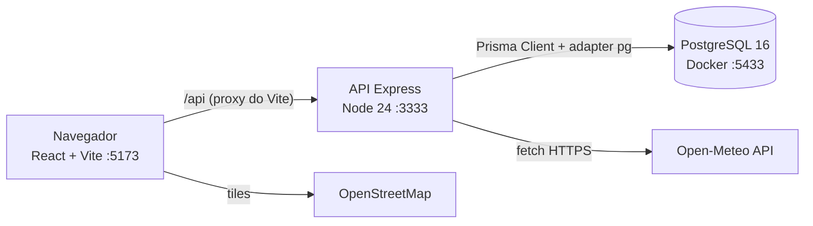
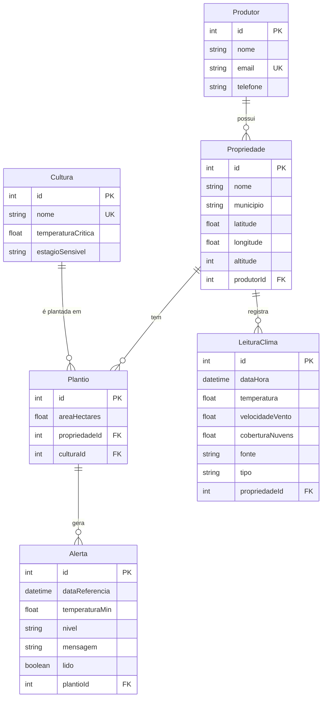

# Arquitetura — GeadaAlerta

## Visão geral

## Camadas do backend (`backend/src`)

| Pasta | Responsabilidade |
|---|---|
| `routes/` | Mapeia URL + método HTTP para o controller. Nenhuma regra aqui. |
| `controllers/` | Recebe a requisição, valida a entrada (zod), chama o Prisma ou um service e devolve o status HTTP. |
| `services/` | Regras de negócio e integrações: `risco.service.js` (cálculo puro, testado), `alerta.service.js` (gera alertas), `clima.service.js` (Open-Meteo). |
| `validators/` | Schemas zod de entrada. |
| `middlewares/` | Tratamento central de erros (zod → 400, Prisma P2002 → 409, P2025 → 404, P2003 → 409, API externa → 502). |
| `lib/prisma.js` | Instância única do Prisma Client (um pool de conexões por processo). |
| `generated/prisma` | Client gerado pelo `prisma generate` (não versionado). |

O enunciado sugere `src/models`. Com o Prisma, os **modelos ficam em `prisma/schema.prisma`**, que é a fonte
única da verdade do banco, e o client gerado faz o papel da camada de modelo.

## Modelo de dados

- `Plantio` resolve o N:N entre Propriedade e Cultura e guarda dados próprios (área, data).
- Chaves únicas compostas evitam duplicidade: `(propriedadeId, culturaId)` em Plantio, `(propriedadeId, dataHora, tipo)`
  em LeituraClima (permite o *upsert* da previsão) e `(plantioId, dataReferencia)` em Alerta.

## Endpoints

| Método | Rota | Descrição |
|---|---|---|
| GET | `/api/health` | Verifica se a API está no ar |
| GET | `/api/dashboard` | Contadores do painel |
| GET/POST | `/api/produtores` | Lista / cria |
| GET/PUT/DELETE | `/api/produtores/:id` | Detalhe / atualiza / remove |
| GET/POST | `/api/propriedades` (`?produtorId=`) | Lista (com `riscoAtual`) / cria |
| GET/PUT/DELETE | `/api/propriedades/:id` | Detalhe com plantios e alertas / atualiza / remove |
| GET/POST | `/api/propriedades/:id/leituras` (`?desde=`) | Leituras / registra leitura manual |
| POST | `/api/propriedades/:id/atualizar-previsao` | Consulta a Open-Meteo e recalcula os alertas |
| GET/POST | `/api/culturas` | Lista / cria |
| GET/PUT/DELETE | `/api/culturas/:id` | Detalhe / atualiza / remove |
| GET/POST | `/api/plantios` (`?propriedadeId=`) | Lista / cria |
| GET/PUT/DELETE | `/api/plantios/:id` | Detalhe / atualiza / remove |
| GET | `/api/alertas` (`?nivel=&lido=&propriedadeId=&periodo=atuais\|todos`) | Lista ordenada por gravidade (padrão: só os atuais) |
| PATCH | `/api/alertas/:id/lido` | Marca como lido |
| DELETE | `/api/alertas/:id` | Remove |

## Decisões de arquitetura

| Decisão | Motivo |
|---|---|
| **Monorepo** (`backend/` e `frontend/`) | Um único repositório, como o enunciado exige, com dependências separadas por camada. |
| **Prisma 7.10 fixado** (e não a "latest") | Em out/2026 a tag `latest` do npm aponta para `8.0.0-rc` (*release candidate*). Uma versão de teste é um risco na apresentação ao vivo. |
| **ESM + Node 24 executando o client `.ts` do Prisma** | O Prisma 7 gera o client em TypeScript. O Node 24 remove os tipos nativamente, então não há etapa de build nem `ts-node`. |
| **PostgreSQL 16 na porta 5433 do host** | O enunciado limita a versão a 15–16. A porta 5433 evita conflito com um Postgres instalado localmente. |
| **Proxy do Vite para `/api`** | O frontend não tem a URL do backend fixa no código e não depende de CORS no desenvolvimento. |
| **Regra de risco isolada em função pura** | Permite testes unitários sem banco (`npm test`) e facilita explicar e ajustar a regra. |
| **zod na entrada da API** | Mensagens de erro claras (400) e nenhum dado inválido chega ao banco. |
| **Open-Meteo** | Gratuita e sem chave de API, então não há segredo para vazar no GitHub. Oferece vento e nebulosidade, necessários para a RN02. |
| **Horários em UTC no banco** | O fuso America/Sao_Paulo é aplicado só na apresentação e no agrupamento por dia, o que evita erros de conversão. |
